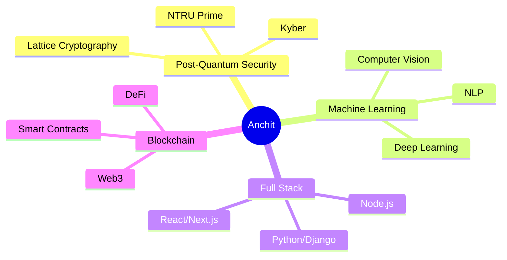

<h1 align="center">
  
</h1>

<p align="center">
  
</p>

<p align="center">
  
  
  
</p>

<div align="center">
  
</div>

---


## 🧑‍💻 WHO AM I?

<table>
<tr>
<td width="50%">

```python
class AnchitLahkar:
    def __init__(self):
        self.name = "Anchit Lahkar"
        self.role = "Full Stack Developer & Security Researcher"
        self.location = "India 🇮🇳"
        self.education = {
            "degree": "Computer Science & Engineering",
            "specialization": ["AI/ML", "Cryptography"]
        }
    
    def get_daily_routine(self):
        return {
            "morning": "☕ Coffee + Code",
            "afternoon": "🔐 Security Research",
            "evening": "🤖 ML Experiments",
            "night": "🌙 Open Source Contributions"
        }
    
    def get_current_focus(self):
        return [
            "🔒 Post-Quantum Cryptography",
            "🤖 Machine Learning & AI",
            "⛓️ Web3 & Blockchain",
            "🛡️ Secure System Architecture",
            "💻 Full Stack Development"
        ]
```

</td>
<td width="50%">

### 📚 Currently Learning
```javascript
const learning = {
    advanced: [
        "🧠 Advanced ML Algorithms",
        "🔐 Quantum-Resistant Security",
        "☁️ Cloud Native Architecture",
        "🎭 Zero-Knowledge Proofs"
    ],
    experimenting: [
        "Web3 Development",
        "Distributed Systems",
        "MLOps & Production ML"
    ]
};
```

### 🎯 2026 Goals
- [ ] 🌟 Contribute to 100+ open source projects
- [ ] 🏗️ Master distributed systems
- [ ] 🤖 Build production-grade AI applications
- [ ] 📝 Publish research in cryptography
- [ ] 🚀 Launch a major security tool

### 🎮 When I'm Not Coding
🖥️ **Coding** (yes, even for fun!) • 🏴‍☠️ **CTF Competitions** • ✍️ **Tech Blogging** • 🌟 **Open Source** • 🎯 **Hackathons**

</td>
</tr>
</table>

<br clear="both"/>

---

## 🔥 WHAT I'M BUILDING

<div align="center">

### 🔐 Security & Cryptography Research


**Working on cutting-edge cryptography projects** | Building quantum-resistant security solutions for the future

<details>
<summary><b>🔍 What is Post-Quantum Cryptography?</b></summary>

<br>

> **Preparing for the quantum computing era** 
> 
> Post-quantum cryptography develops encryption methods that remain secure even against attacks from future quantum computers. As quantum computing advances, traditional encryption (RSA, ECC) becomes vulnerable. PQC uses mathematics-based approaches like lattice-based cryptography, hash-based signatures, and code-based schemes to ensure long-term security.

**Why It Matters:**
- 🔐 Protects against "harvest now, decrypt later" attacks
- 🛡️ Future-proofs sensitive communications and data
- 🚀 Essential for long-term security infrastructure
- 📊 Aligned with NIST standardization (2024-2025)

**My Focus Areas:**
- Lattice-based key exchange mechanisms (NTRU Prime, Kyber)
- Zero-knowledge proof systems
- Secure protocol design and implementation
- Performance optimization for production systems

**Technologies:** Python, Cryptography Libraries, Mathematical Algorithms, Security Protocols

</details>

</div>

---

## 🛠️ TECH STACK & EXPERTISE

<div align="center">

### 👨‍💻 Languages


### 🎨 Frontend Development


### ⚡ Backend & APIs


### 🤖 AI/ML & Data Science


### 🔐 Cryptography & Security


### 🗄️ Databases


### ☁️ Cloud & DevOps


### 🛠️ Tools & Platforms


</div>

---

## 📊 GITHUB STATISTICS

<div align="center">
   
  
</div>

<div align="center">
  
  
</div>

<div align="center">
  
</div>

---

## 🚀 FEATURED PROJECTS

<div align="center">

<table>
<tr>
<td width="50%">

### 🤖 Alphabet Detection ML
[](https://github.com/Anchitlahkar/Alphabet-Detection)

</td>
<td width="50%">

### 🔒 Random Encryption
[](https://github.com/Anchitlahkar/Random-Encryption)

</td>
</tr>

<tr>
<td width="50%">

### 🔍 Web Search Engine
[](https://github.com/Anchitlahkar/Web_Search)

</td>
<td width="50%">

### 🏥 Medical Project
[](https://github.com/Anchitlahkar/Project_Medical)

</td>
</tr>

<tr>
<td width="50%">

### 🗺️ Map API Integration
[](https://github.com/Anchitlahkar/Map-api)

</td>
<td width="50%">

### 🌐 Web Design Projects
[](https://github.com/Anchitlahkar/Web_designe)

</td>
</tr>
</table>

</div>

---

## 📈 CONTRIBUTION GRAPH

<div align="center">
  
</div>

<div align="center">
  
</div>

---

## 🏆 ACHIEVEMENTS & METRICS

<div align="center">


</div>

---

## 🌐 CONNECT WITH ME

<div align="center">

[](https://linkedin.com/in/yourprofile)
[](https://twitter.com/yourhandle)
[](https://yourportfolio.com)
[](mailto:<a href="/cdn-cgi/l/email-protection" class="__cf_email__" data-cfemail="1960766c6b7c74787075597c61787469757c377a7674">[email&#160;protected]</a>)
[](https://discord.com/users/yourid)
[](https://instagram.com/yourhandle)
[](https://youtube.com/@yourchannel)
[](https://medium.com/@yourhandle)

</div>

---

## 💭 RANDOM DEV QUOTE

<div align="center">


</div>

---

## 🐍 CONTRIBUTION SNAKE

<div align="center">
  


</div>

<div align="center">
  <sub>⚠️ <i>If the snake animation doesn't appear, it means the GitHub Actions workflow needs to be set up. Check the setup guide for instructions.</i></sub>
</div>

---

## 📊 WEEKLY DEVELOPMENT BREAKDOWN

<div align="center">

<!--START_SECTION:waka-->


<!--END_SECTION:waka-->

<sub>💡 <i>Connect with WakaTime to see your weekly coding stats here!</i></sub>

</div>

---

## 🎯 CURRENT FOCUS

<div align="center">



</div>

---

<div align="center">

### 💡 *"Any sufficiently advanced technology is indistinguishable from magic."* - Arthur C. Clarke

</div>

---

<div align="center">

### ⚡ Quick Stats


**📫 How to reach me:**
- Email: <a href="/cdn-cgi/l/email-protection" class="__cf_email__" data-cfemail="7900160c0b571c14181015391c01181409151c571a1614">[email&#160;protected]</a>
- LinkedIn: [/in/yourprofile](https://linkedin.com/in/yourprofile)
- Portfolio: [yourportfolio.com](https://yourportfolio.com)

**🎯 2026 Goals:**
- ✅ Contribute to more open source projects
- ✅ Master cloud architecture
- ✅ Build production AI systems
- ✅ Publish security research

**⚡ Fun fact:** I write more code than I write text messages! 

</div>

---

<div align="center">
  
</div>

<div align="center">

### Show some ❤️ by starring some of my repositories!

[](https://github.com/Anchitlahkar)
[](https://github.com/Anchitlahkar)

</div>

---

<div align="center">

![Typing SVG](htt
