<!-- ░▒▓█ HEADER █▓▒░ -->
<a href="#">
  
</a>

<div align="center">

<a href="https://github.com/Anchitlahkar">
  
</a>

<br/>


</div>

<br/>

<!-- ◢◤ ABOUT ◢◤ -->
<div align="center">

## ◢◤ ▓ NEON.INIT() — whoami ▓ ◥◣

</div>

<table>
<tr>
<td width="52%" valign="top">

```yaml
anchit_lahkar:
  role: Undergraduate Research Assistant
  focus: Quantum Machine Learning
  degree: B.Tech CSE
  university: SRM Institute of Science and Technology
  campus: Kattankulathur (KTR)
  batch: 2025 - 2029
  cgpa: 9.8 / 10
  nirf_rank: 11
  origin: Guwahati, Assam
  based_in: Chennai, India
  current_lab: Variational Quantum Circuits
  currently_learning:
    - Qiskit Runtime
    - Quantum Error Mitigation
    - LangChain
  motto: "Ship fast, benchmark harder."
```

</td>
<td width="48%" valign="top">


</td>
</tr>
</table>

<br/>

<!-- ▓▒░ PROJECTS ░▒▓ -->
<div align="center">

## ▓ ◤ FEATURED_BUILDS[] ◥ ▓

<em>Seven signals from the grid — quantum, security, and the full stack.</em>

<br/>

<table>
<tr>
<td width="50%" valign="top">

### ◈ CarbonSense
AI carbon-footprint platform — TERRA AI coach on Gemini 1.5 Flash, a 3D Planet Twin in React Three Fiber, receipt OCR, deterministic TS carbon math, 258 unit tests.


<br/>

<br/>
<a href="https://github.com/Anchitlahkar/CarbonSense"></a>

</td>
<td width="50%" valign="top">

### ◈ QHack Quantum Lab
Full-stack quantum circuit workbench — 20+ gates, Qiskit Aer backend streamed over WebSocket, Bloch-sphere playback, circuit comparison via Bhattacharyya coefficient.


<br/>

<br/>
<a href="https://qinsight-sigma.vercel.app"></a>

</td>
</tr>

<tr>
<td width="50%" valign="top">

### ◈ QSecureX
Post-quantum file exchange — Kyber768 + ML-DSA-44 (liboqs), AES-256-GCM, resumable chunked uploads, PyQt6 desktop GUI.


<br/>

<br/>
<a href="https://github.com/Anchitlahkar/QSecureX"></a>

</td>
<td width="50%" valign="top">

### ◈ Alpha-Forge
Zero-infra research-intelligence pipeline — RSS scanning, Gemini scoring via weighted signal formula, Pydantic validation, glassmorphism dashboard on GitHub Pages, Telegram delivery.


<br/>

<br/>
<a href="https://github.com/Anchitlahkar/Alpha-Forge"></a>

</td>
</tr>

<tr>
<td width="50%" valign="top">

### ◈ ForkCast
Realtime multiplayer restaurant-voting app — Next.js 15, Firestore transactions, Google Places, swipe gestures.


<br/>

<br/>
<a href="https://github.com/Anchitlahkar/ForkCast"></a>
<a href="https://forkcast-iota.vercel.app"></a>

</td>
<td width="50%" valign="top">

### ◈ Frame2Scene
Photogrammetry pipeline — FFmpeg frame extraction → COLMAP dense reconstruction → custom C++/Raylib point-cloud viewer.


<br/>

<br/>
<a href="https://github.com/Anchitlahkar/Frame2Scene"></a>

</td>
</tr>

<tr>
<td width="50%" valign="top">

### ◈ Dreams Creation
Production website for a 3-branch preschool (220+ students) — Next.js SSR, GSAP motion.


<br/>

<br/>
<a href="https://dreamscreation.vercel.app"></a>

</td>
<td width="50%" valign="top">

### ◈ More on the grid
The signal keeps building — quantum tooling, security primitives, and web experiments ship regularly.

<br/>

<a href="https://github.com/Anchitlahkar?tab=repositories"></a>

</td>
</tr>
</table>

</div>

<br/>

<!-- ░▒▓ RESEARCH ▓▒░ -->
<div align="center">

## ⟢ RESEARCH_SPOTLIGHT ⟣

</div>

<table>
<tr>
<td valign="top">

> **Variational Quantum Circuits for Forest-Fire Detection**
> Undergraduate Research Assistant · Jan 2026 – present · SRMIST
> Advisor: **Dr. Manju A**

Building binary classifiers for early forest-fire detection using **Variational Quantum Circuits** in **PennyLane**, benchmarked head-to-head against **Logistic Regression** and **Random Forest** baselines. Current line of investigation: the trade-offs between **amplitude encoding** and **angle encoding** — where each wins on expressivity, depth, and trainability.


</td>
</tr>
</table>

<br/>

<!-- ▓ STACK ▓ -->
<div align="center">

## ◤ STACK.dll — loaded modules ◥


<br/>


<br/><br/>

<table>
<tr>
<td align="center"><b>◈ Languages</b></td>
<td>Python · JavaScript · TypeScript · C++ · Java</td>
</tr>
<tr>
<td align="center"><b>◈ Web / API</b></td>
<td>React · Next.js · Node.js · FastAPI · Flask</td>
</tr>
<tr>
<td align="center"><b>◈ Quantum</b></td>
<td>PennyLane · Qiskit</td>
</tr>
<tr>
<td align="center"><b>◈ AI / ML</b></td>
<td>Scikit-Learn · OpenCV · TensorFlow · PyTorch · Gemini API</td>
</tr>
<tr>
<td align="center"><b>◈ Data</b></td>
<td>MySQL · Firebase · Supabase</td>
</tr>
<tr>
<td align="center"><b>◈ DevOps</b></td>
<td>Vercel · GitHub Actions · CI/CD</td>
</tr>
<tr>
<td align="center"><b>◈ Learning</b></td>
<td>Qiskit Runtime · Quantum Error Mitigation · LangChain</td>
</tr>
</table>

</div>

<br/>

<!-- ▓ ACHIEVEMENTS ▓ -->
<div align="center">

## ⚡ TROPHY_CACHE — high scores ⚡

<table>
<tr>
<th>Achievement</th>
<th>Detail</th>
<th>When</th>
</tr>
<tr>
<td>🏆 <b>Google Prompt Wars 2026</b></td>
<td>Rank #727 / 35,548 — <b>Top 2%</b> for CarbonSense</td>
<td>2026</td>
</tr>
<tr>
<td>🥇 <b>ICPC — High Honor</b></td>
<td>Chennai Regional</td>
<td>Nov 2025</td>
</tr>
<tr>
<td>🚀 <b>Ultron 9.0 Hackathon</b></td>
<td>Top 10 / 300+ teams — led team, shipped QSecureX</td>
<td>Jan 2026</td>
</tr>
<tr>
<td>🥉 <b>Ship In a Day Buildathon</b></td>
<td>3rd place — ForkCast</td>
<td>Mar 2026</td>
</tr>
</table>

</div>

<br/>

<!-- ░▒▓█ DYNAMIC ZONE █▓▒░ -->
<div align="center">

## ▓▒░ THE_GRID — live telemetry ░▒▓

<br/>

<!-- Pacman contribution graph -->
<picture>
  <source media="(prefers-color-scheme: dark)" srcset="https://raw.githubusercontent.com/Anchitlahkar/Anchitlahkar/output/pacman-contribution-graph-dark.svg"/>
  <source media="(prefers-color-scheme: light)" srcset="https://raw.githubusercontent.com/Anchitlahkar/Anchitlahkar/output/pacman-contribution-graph.svg"/>
  
</picture>

<br/><br/>

<!-- 3D contribution graph -->


<br/><br/>

<!-- Metrics -->


<br/><br/>

<!-- Streak -->


<br/><br/>

<!-- Activity graph -->


<br/><br/>

<!-- Achievements (self-generated, replaces flaky trophy service) -->


</div>

<br/>

<!-- ▓ DOMAIN MAP ▓ -->
<div align="center">

## ◢◤ DOMAIN_MAP.mmd ◥◣

```mermaid
graph TD
    ROOT["Anchit Lahkar"]:::root

    ROOT --> QML["Quantum ML"]:::quantum
    ROOT --> SEC["PQC / Security"]:::security
    ROOT --> WEB["Full-Stack"]:::web
    ROOT --> WIN["Achievements"]:::wins

    QML --> Q1["Variational Quantum Circuits"]:::quantum
    QML --> Q2["PennyLane / Qiskit"]:::quantum
    QML --> Q3["Amplitude vs Angle Encoding"]:::quantum

    SEC --> S1["Kyber768 + ML-DSA-44"]:::security
    SEC --> S2["AES-256-GCM"]:::security
    SEC --> S3["QSecureX"]:::security

    WEB --> W1["React / Next.js"]:::web
    WEB --> W2["FastAPI / Flask"]:::web
    WEB --> W3["CarbonSense / ForkCast"]:::web

    WIN --> A1["Prompt Wars Top 2%"]:::wins
    WIN --> A2["ICPC High Honor"]:::wins
    WIN --> A3["Ultron 9.0 Top 10"]:::wins

    classDef root fill:#0d0221,stroke:#ff2ec4,stroke-width:3px,color:#ffffff;
    classDef quantum fill:#1a0533,stroke:#b026ff,stroke-width:2px,color:#b026ff;
    classDef security fill:#1a0533,stroke:#2de2e6,stroke-width:2px,color:#2de2e6;
    classDef web fill:#1a0533,stroke:#ff2ec4,stroke-width:2px,color:#ff2ec4;
    classDef wins fill:#1a0533,stroke:#ff9e00,stroke-width:2px,color:#ff9e00;
```

</div>



<br/>

<!-- ▓ CONNECT ▓ -->
<div align="center">

## ⟢ ESTABLISH_CONNECTION() ⟣

<a href="https://linkedin.com/in/anchit-lahkar">
  
</a>
<a href="mailto:anchitlahkar0202@gmail.com">
  
</a>
<a href="https://anchitlahkar.vercel.app">
  
</a>

<br/><br/>

<em>「 Ship fast. Benchmark harder. Encode everything. 」</em>

</div>

<img width="100%" src="https://capsule-render.vercel.app/api?type=venom&height=160&section=footer&color=0:0d0221,30:7209b7,70:f72585,100:ff9e00&animation=fadeIn" a