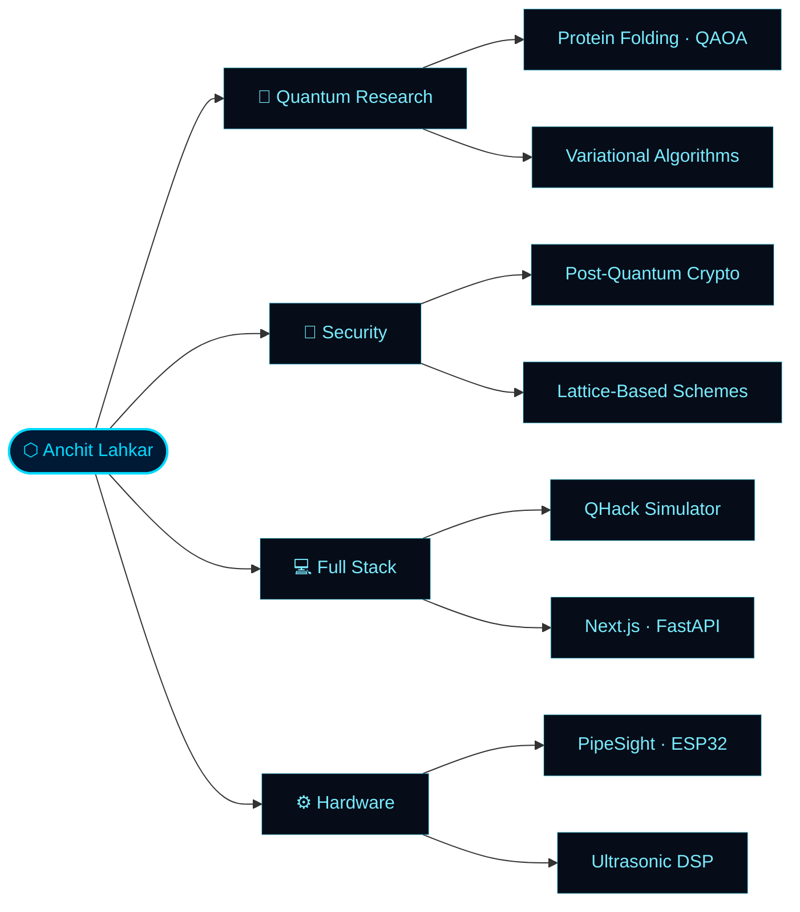

<!-- ████████████████████████ HEADER ████████████████████████ -->
<div align="center">
  
</div>

<div align="center">
  
</div>

<br/>

<div align="center">

[](https://github.com/Anchitlahkar)&ensp;[](https://github.com/Anchitlahkar)&ensp;[](https://github.com/Anchitlahkar)&ensp;[](https://github.com/Anchitlahkar)

</div>

<br/>

---

<!-- ████████████████████████ IDENTITY ████████████████████████ -->

## `> IDENTITY`

<table>
<tr>
<td width="58%">

```python
class AnchitLahkar:

    # ─── Core ────────────────────────────────
    university = "SRMIST Kattankulathur"
    degree     = "B.Tech CSE  (2025 – 2029)"
    cgpa       = 9.6
    location   = "Guwahati, Assam  🇮🇳"

    # ─── Research ────────────────────────────
    lab        = "Quantum-Inspired Optimization"
    topic      = "Protein Folding via QAOA"
    advisor    = "Dr. Manju A."
    pipeline   = ["Qiskit", "PyRosetta", "QAOA",
                  "Simulated Annealing"]

    # ─── Stack ───────────────────────────────
    stack      = ["Python", "TypeScript", "Next.js",
                  "React", "FastAPI", "TailwindCSS",
                  "Zustand", "Qiskit"]

    # ─── Honors ──────────────────────────────
    honors     = {
        "ICPC High Honor"  : "Chennai 2025",
        "Ultron 9.0"       : "Top 10 / 300+",
    }
```

</td>
<td width="42%" align="center">


<br/>

[](https://github.com/Anchitlahkar)&nbsp;
[](https://github.com/Anchitlahkar?tab=repositories)&nbsp;
[](https://github.com/Anchitlahkar)

</td>
</tr>
</table>

---

<!-- ████████████████████████ BUILDS ████████████████████████ -->

## `> ACTIVE BUILDS`

<table>
<tr>

<td width="33%" valign="top">
<div align="center">

**⬡ &nbsp; Q H A C K**

</div>

Quantum Circuit Simulator with a **Quantum Noir** UI. Custom SVG canvas, 15-gate system, animated Bloch sphere, and real-time simulation flow.

<div align="center">


[](https://github.com/Anchitlahkar)

</div>
</td>

<td width="33%" valign="top">
<div align="center">

**⬡ &nbsp; P I P E S I G H T**

</div>

ESP32 hardware system for **non-invasive corrosion detection** using 40 kHz ultrasonic transducers and IRLZ44N MOSFET driver circuits.

<div align="center">


[](https://github.com/Anchitlahkar)

</div>
</td>

<td width="33%" valign="top">
<div align="center">

**⬡ &nbsp; QX-SECURE**

</div>

Post-quantum cryptography implementation — **lattice-based key exchange**, quantum-resistant protocol design, aligned with NIST PQC standards.

<div align="center">


[](https://github.com/Anchitlahkar)

</div>
</td>

</tr>
</table>

---

<!-- ████████████████████████ TECH STACK ████████████████████████ -->

## `> ARSENAL`

<div align="center">


<br/><br/>

<table>
<tr>
<td align="center" width="20%"><sub><b>Languages</b></sub><br/>Python · TypeScript · C++</td>
<td align="center" width="20%"><sub><b>Frontend</b></sub><br/>React · Next.js · Tailwind · Zustand</td>
<td align="center" width="20%"><sub><b>Backend</b></sub><br/>FastAPI</td>
<td align="center" width="20%"><sub><b>Quantum</b></sub><br/>Qiskit · PyRosetta · NumPy</td>
<td align="center" width="20%"><sub><b>Hardware</b></sub><br/>ESP32 · C++ · Ultrasonic DSP</td>
</tr>
</table>

</div>

---

<!-- ████████████████████████ RESEARCH ████████████████████████ -->

## `> RESEARCH`

<div align="center">

```
┌─────────────────────────────────────────────────────────────────────────────┐
│   QUANTUM-INSPIRED OPTIMIZATION FOR PROTEIN FOLDING                         │
│   Undergraduate Research · SRMIST · Advisor: Dr. Manju A.                   │
└─────────────────────────────────────────────────────────────────────────────┘
```

</div>

Modelling protein **conformational energy landscapes** using hybrid classical–quantum pipelines. Benchmarks classical **Simulated Annealing** against **QAOA** (Quantum Approximate Optimization Algorithm) implemented in Qiskit, with **PyRosetta** for energy scoring.

<div align="center">

`Combinatorial Optimization` &nbsp;·&nbsp; `Variational Quantum Algorithms` &nbsp;·&nbsp; `Energy Landscape Traversal` &nbsp;·&nbsp; `Hybrid Pipelines`

</div>

---

<!-- ████████████████████████ FOCUS MAP ████████████████████████ -->

## `> FOCUS MAP`



---

<!-- ████████████████████████ STATS ████████████████████████ -->

## `> METRICS`

<div align="center">
  
  
</div>

<div align="center">
  
</div>

---

<!-- ████████████████████████ SNAKE ████████████████████████ -->

## `> CONTRIBUTION TRACE`

<div align="center">
  
</div>

---

<!-- ████████████████████████ HONORS ████████████████████████ -->

## `> HONORS`

<div align="center">

| &nbsp; | Achievement | Venue | Year |
|:---:|---|---|:---:|
| 🏆 | **ICPC High Honor** | ICPC Asia Regional — Chennai | 2025 |
| 🥇 | **Top 10 / 300+** | Ultron 9.0 Hackathon | 2026 |
| 🔬 | **Undergraduate Researcher** | SRMIST — Quantum Optimization | Active |

</div>

---

<!-- ████████████████████████ CONNECT ████████████████████████ -->

## `> REACH ME`

<div align="center">

[](https://linkedin.com/in/anchit-lahkar)&nbsp;
[](https://github.com/Anchitlahkar)&nbsp;
[](mailto:anchitlahkar0202@gmail.com)&nbsp;
[](https://anchitlahkar.vercel.com)

<br/>

<sub><code>open to research collaborations · internships · open source</code></sub>

</div>

---

<!-- ████████████████████████ FOOTER ████████████████████████ -->
<div align="center">
  
</div>
