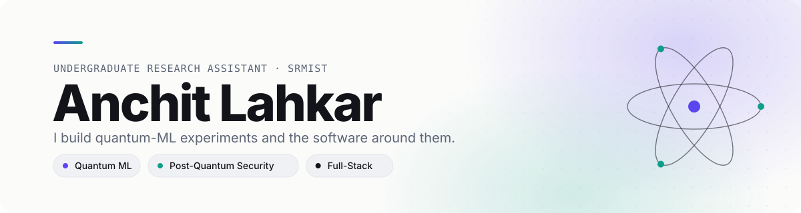

<picture>
  <source media="(prefers-color-scheme: dark)" srcset="assets/hero-dark.svg">
  
</picture>

  <a href="https://anchitlahkar.vercel.app"><b>Portfolio</b></a> &nbsp;·&nbsp;
  <a href="https://linkedin.com/in/anchit-lahkar"><b>LinkedIn</b></a> &nbsp;·&nbsp;
  <a href="mailto:anchitlahkar0202@gmail.com"><b>Email</b></a> &nbsp;·&nbsp;
  <a href="Anchit_Lahkar_Resume.pdf"><b>Résumé (PDF)</b></a>

 

## About

B.Tech CSE student at **SRM Institute of Science and Technology** (Kattankulathur, 2025–2029), originally from Guwahati, now in Chennai. CGPA **9.8 / 10**.

Since January 2026 I've been an undergraduate research assistant under **Dr. Manju A**, working on **variational quantum circuits** for binary classification. Outside the lab I ship full-stack products and hackathon projects, mostly where AI, security, or quantum computing meets a real interface.

|   |   |
|---|---|
| **Research** | Quantum machine learning — variational circuits, encoding strategies |
| **Building** | Full-stack apps, post-quantum cryptography tooling |
| **Learning** | Qiskit Runtime · Quantum error mitigation · LangChain |
| **Competing** | ICPC Chennai Regional (High Honor), hackathons, buildathons |

<picture><source media="(prefers-color-scheme: dark)" srcset="assets/divider-dark.svg"></picture>

## Research

**Variational Quantum Circuits for Forest-Fire Detection**
 Undergraduate Research Assistant · Jan 2026 – present · SRMIST · Advisor: Dr. Manju A

Binary classifiers for early forest-fire detection built as variational quantum circuits in **PennyLane**, benchmarked head-to-head against **Logistic Regression** and **Random Forest** baselines. The current question is how **amplitude encoding** and **angle encoding** trade off on expressivity, circuit depth, and trainability.

<picture><source media="(prefers-color-scheme: dark)" srcset="assets/divider-dark.svg"></picture>

## Selected work

<table>
<tr>
<td width="50%" valign="top">

#### [CarbonSense](https://github.com/Anchitlahkar/CarbonSense)
AI carbon-footprint platform. TERRA, an AI coach on Gemini 1.5 Flash, a 3D "Planet Twin" in React Three Fiber, receipt OCR, and deterministic TypeScript carbon math covered by 258 unit tests.
  
`React` `TypeScript` `Gemini` `Three.js`
 
🏆 **Top 2% · Google Prompt Wars** (#727 / 35,548)

</td>
<td width="50%" valign="top">

#### [QHack Quantum Lab](https://qinsight-sigma.vercel.app)
Full-stack quantum circuit workbench. 20+ gates, a Qiskit Aer backend streamed over WebSocket, Bloch-sphere playback, and circuit comparison via the Bhattacharyya coefficient.
  
`Python` `Qiskit` `WebSocket`
 
⚛️ [**Live demo →**](https://qinsight-sigma.vercel.app)

</td>
</tr>
<tr>
<td width="50%" valign="top">

#### [QSecureX](https://github.com/Anchitlahkar/QSecureX)
Post-quantum secure file exchange: Kyber768 key encapsulation, ML-DSA-44 signatures (liboqs), AES-256-GCM, resumable chunked uploads, PyQt6 desktop client.
  
`Python` `liboqs` `PyQt6`
 
🚀 **Top 10 of 300+ teams · Ultron 9.0** (team lead)

</td>
<td width="50%" valign="top">

#### [Alpha-Forge](https://github.com/Anchitlahkar/Alpha-Forge)
Zero-infrastructure research-intelligence pipeline. Scans RSS feeds, scores items with Gemini using a weighted signal formula, validates with Pydantic, publishes a dashboard on GitHub Pages and delivers via Telegram.
  
`Python` `Gemini` `Pydantic` `GitHub Actions`

</td>
</tr>
<tr>
<td width="50%" valign="top">

#### [ForkCast](https://github.com/Anchitlahkar/ForkCast)
Realtime multiplayer restaurant-voting app. Next.js 15, Firestore transactions, Google Places, swipe gestures.
  
`Next.js` `Firestore` `Google Places`
 
🥉 **3rd place · Ship In a Day** &nbsp;·&nbsp; [Live →](https://forkcast-iota.vercel.app)

</td>
<td width="50%" valign="top">

#### [Frame2Scene](https://github.com/Anchitlahkar/Frame2Scene)
Photogrammetry pipeline: FFmpeg frame extraction, COLMAP dense reconstruction, and a custom C++ / Raylib point-cloud viewer.
  
`C++` `COLMAP` `FFmpeg` `Raylib`

</td>
</tr>
<tr>
<td width="50%" valign="top">

#### [Dreams Creation](https://dreamscreation.vercel.app)
Production website for a three-branch preschool (220+ students). Next.js with server-side rendering and GSAP motion.
  
`Next.js` `GSAP`
 
🟢 In production &nbsp;·&nbsp; [Live →](https://dreamscreation.vercel.app)

</td>
<td width="50%" valign="top">

#### More
Quantum tooling, security primitives and web experiments land regularly.
  
**[Browse all repositories →](https://github.com/Anchitlahkar?tab=repositories)**

</td>
</tr>
</table>

<picture><source media="(prefers-color-scheme: dark)" srcset="assets/divider-dark.svg"></picture>

## Recognition

| When | What | Detail |
|:--|:--|:--|
| 2026 | **Google Prompt Wars** | Rank #727 of 35,548 (top 2%) with CarbonSense |
| Mar 2026 | **Ship In a Day Buildathon** | 3rd place with ForkCast |
| Jan 2026 | **Ultron 9.0 Hackathon** | Top 10 of 300+ teams; led the team and shipped QSecureX |
| Nov 2025 | **ICPC Chennai Regional** | High Honor |

<picture><source media="(prefers-color-scheme: dark)" srcset="assets/divider-dark.svg"></picture>

## Toolbox

| | |
|:--|:--|
| **Languages** | Python · TypeScript · JavaScript · C++ · Java |
| **Web & APIs** | React · Next.js · Node.js · FastAPI · Flask |
| **Quantum** | PennyLane · Qiskit |
| **AI / ML** | scikit-learn · PyTorch · TensorFlow · OpenCV · Gemini API |
| **Data** | MySQL · Firebase · Supabase |
| **Ship & Ops** | Vercel · GitHub Actions · Git |

<picture><source media="(prefers-color-scheme: dark)" srcset="assets/divider-dark.svg"></picture>

## Activity

  
  

  

<b>More metrics</b>

 

  

 

Ship fast. Benchmark harder.

